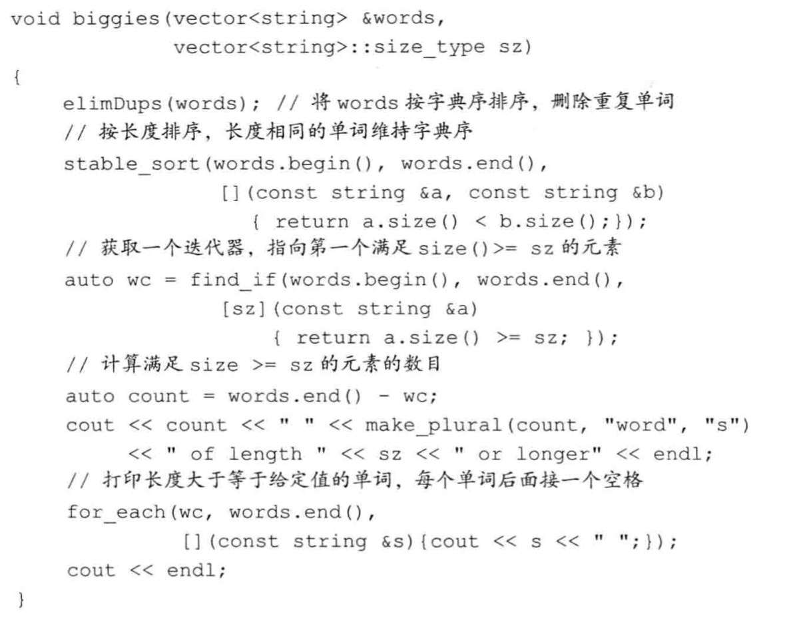

# 泛型算法
标准库并没有给每个容器提供大量功能，而是提供了一组算法，这些算法中的大多数都是独立于任何特定容器的。

# 概述
# 初始泛型算法

# 定制操作
很多算法都会比较输入序列中的元素，默认情况都是使用元素类型的<或者==运算符来比较，我们还可以提供自己定义的操作来代替默认运算符。

## 10.3.1 向算法传递函数

## 谓词
* 为了按长度重排vector，我们使用重载过的sort，它接受第三个参数，这个参数是一个**谓词(predicate)**
* 谓词是一个可调用的表达式，返回值是一个能用作条件的值。标准库算法所使用的谓词分为两类：一元谓词(unary predicate，只接受单一参数)和二元谓词(binary predicate，它有两个参数)
* 接受一个二元谓词参数的sort用这个谓词来替代<来比较元素
```c++
    bool isShorter(const string& s1, const string& s2)
    {
        return s1.size() < s2.size()
    }
    
    sort(words.begin(), words.end(), isShorter);
```

## 排序算法
stable_sort算法，这种稳定排序算法维持了相等元素的原有顺序。

## 10.3.2 lambda表达式
<u>根据算法接受一元谓词还是二元谓词，我们传递给算法的谓词必须严格接受一个或者两个参数。这就带来了不方便，因为有时我们希望更多的参数，这就超出了算法对谓词的限制。所以这里引入了lambda表达式。</u>
* 我们可以向一个算法传递任何类别的**可调用对象(callable object)**
* 四种可调用对象：函数；函数指针；重载了函数调用运算符的类；lambda表达式；

*lambda表达式：*
*[capture list](parameter list) -> return type {function body}*

* capture list是一个lambda所以函数中定义的局部变量的列表（通常为空）
* parameter list，return type和function body与普通函数一样
* lambda必须使用尾置返回来指定返回类型
* 我们可以忽略参数列表和返回类型，但必须包含捕获列表和函数体

```c++
    auto f = [] { return 42; } // 定义了一个可调用对象f，它不接受参数
    cout << f() << endl; // lambda的调用方式与普通函数的调用方式相同，都是使用调用运算符
```
* lambda中忽略括号和参数列表等价于一个空参数列表
* 如果忽略返回参数，lambda根据函数体中的代码推断出返回值类型
* 否则，返回类型为void

### 完整的biggies函数列子
