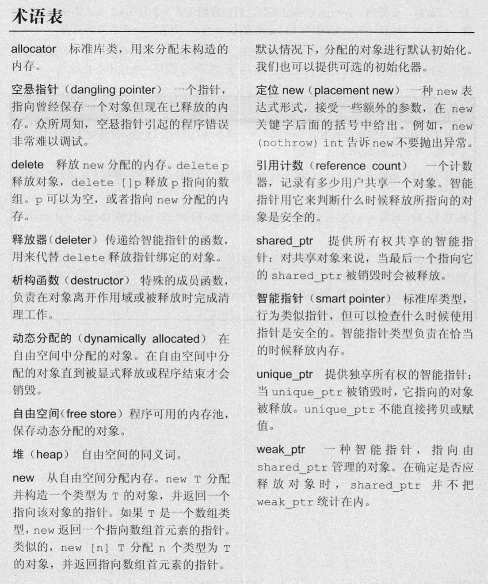

# 动态内存

**静态内存：**
用来保存：
* 局部static对象；
* 类的static数据成员；
* 定义在任何函数体外的变量；

**栈内存（stack）：**
用来保存定义在函数体内的非static对象。

*分配在静态或者栈内存中的对象由编译器自动创建和销毁。对于栈对象，仅在其定义的程序块运行时才存在；static对象在使用之前分配，在程序结束时销毁。*

**动态内存（堆 heap; 自由空间 free store）：**
用来存储动态分配的对象，即那些在程序运行时分配的对象。动态对象的生存期由程序来控制。

## 12.1 动态内存与智能指针
C++中动态内存的管理：new和delete这一对运算符
为了更安全，C++ 11提供了两种职能指针类型来管理动态对象：
* shared_ptr：允许多个指针指向同一个对象。
* unique_ptr：“独占”所指向的对象。
* weak_ptr伴随类：它是一种弱引用，指向shared_ptr所管理的对象。

### 12.1.1 shared_ptr类
shared_ptr和unique_ptr支持的操作:


#### make_shared函数
最安全的分配和使用动态内存的方法是调用一个名为make_shared的标准库函数。此函数在动态内存中分配一个对象并初始化它，返回指向此对象的shared_ptr。

#### shared_ptr的拷贝和赋值
shared_ptr关联一个计数器，称之为引用计数（reference count）。
当拷贝一个shared_ptr时，计数器会增加。例如：
* 用一个shared_ptr初始化另一个shared_ptr
* 将其作为参数传递给一个函数
* 以及当作为一个函数的返回值时

而当给shared_ptr赋予一个新值或是shared_ptr被销毁时（如一个局部的shared_ptr离开其作用域时），计数器就会递减。

#### shared_ptr自动销毁所管理的对象···
当所指对象的最后一个shared_ptr被销毁时，shared_ptr类会自动销毁对象，这是通过析构函数来实现的。

#### shared_ptr还会自动释放相关的内存···
由于在最后一个shared_ptr销毁前内存都不会释放，所以保证shared_ptr在无用之后不再保留就非常重要了。
shared_ptr在无用之后仍然保留的一种可能情况是，你将shared_ptr存放在一个容器中，随后重排了容器，从而不再需要某些元素。在这种情况下，你应该确保用erase删除那些不再需要的shared_ptr元素 :question:

#### 使用了动态生存期的资源的类
程序使用动态内存处于以下三种原因之一：
* 程序不知道自己需要使用多少对象 :question:
* 程序不知道所需对象的准确类型 :question:
* 程序需要在多个对象间共享数据

### 12.1.2 直接内存管理
C++定义了两个运算符来分配和释放内存。new分配内存，delete释放new分配的内存。相对于智能指针，使用这两个运算符管理内存非常容易出错。
#### 使用new动态分配和初始化对象
#### 动态分配的const对象
#### 内存耗尽
#### 释放动态内存
#### 指针值和delete
#### 动态对象的生存期直到被释放时为止
Alert：动态内存的管理非常容易出错

#### delete之后重置指针值

### 12.1.3 shared_ptr和new结合使用
我们还可以用new返回的指针来初始化智能指针，但是要注意接受指针参数的智能指针构造参数时是explicit的。因此，我们不能将一个内置指针隐式转换为一个智能指针，必须使用直接初始化形式来初始化一个智能指针：
```C++
    shared_ptr<int> p1 = new int(1024); // error
    shared_ptr<int> p2(new int(1024));  // correct
```
### 12.1.4 智能指针和异常
函数的退出有两种可能，正常处理结束或者发生了异常，无论哪种情况，局部对象都会被销毁。
* 如果使用智能指针，即使程序块过早的结束，智能指针类也能确保在内存不再需要时将其释放。
* 与之相对的，当发生异常时，我们直接管理的内存是不会自动释放的（例如使用内置指针管理内存，且在new和delete之间发生了异常，则内存不会释放）

Alert: 智能指针陷阱


### 12.1.5 unique_ptr
一个unique_ptr“独占”它所指向的对象。与shared_ptr不同，某个时刻只能有一个unique_ptr指向一个给定对象。当unique_ptr被销毁时，它所指向的对象也被销毁。

因为没有类似make_shared的标准库函数返回一个unique_ptr，所以我们在定义一个unique_ptr时，需要将其绑定到一个new返回的指针上。这一定与shared_ptr类似，初始化unique_ptr时必须采用直接初始化形式：
```C++
    unique_ptr<int> ptr(new int(1024)); 
```

由于unique_ptr“独占”它指向的对象，因此unique_ptr不支持普通的拷贝或者赋值操作：
```C++
    unique_ptr<string> p1(new string("qqq")); 
    unique_ptr<string> p2(p1) // error: not supported for copy
    unique_ptr<string> p3;
    p3 = p1; // error: not supported for =
```

unique_ptr操作：

虽然我们不能拷贝或赋值unique_ptr，但是可以通过release或者reset将指针的所有权从一个（非const）unique_ptr转移给另一个unique_ptr:
```C++
    unique_ptr<string> p2(p1.release()) // 所有权从p1转移给了p2
    unique_ptr<string> p3(new string("123"));
    p2.reset(p3.release()); // reset释放了p2原来指向的内存
```
*release返回的指针通常被用来初始化另一个智能指针，但是如果不用另一个智能指针来保存release返回的指针，我们的程序就要负责资源的释放。*


### 12.1.5 weak_ptr
weak_ptr是一种不控制所指为何对象生存期的智能指针，它指向一个shared_ptr管理的对象。将weak_ptr绑定到shared_ptr上不会改变shared_ptr的计数。
一旦最后一个指向对象的shared_ptr被销毁，对象就会被释放。即使有weak_ptr指向对象，对象也还是会被释放，所以它是一种“弱”引用。

weak_ptr操作：

当创建weak_ptr时，要用一个shared_ptr来初始化它:
```C++
    auto ptr = make_shared<int>(1024);
    weak_ptr<int> wptr(ptr);
    weak_ptr<int> wptr2 = ptr;
```

由于对象可能不存在，所以不能用weak_ptr直接访问对象，而必须调用lock来得到一个shared_ptr：
```C++
    if (shared_ptr<int> sp = wptr.lock()) {
        ...
    }
```


# 动态数组
# 使用标准库：文本查询程序

# 术语表
