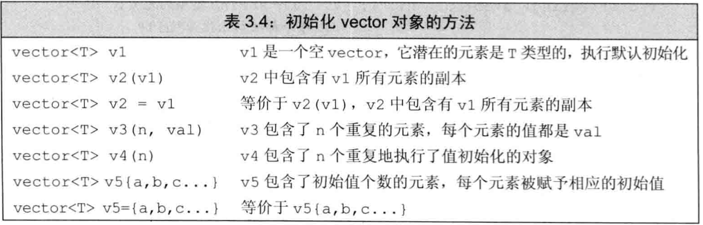
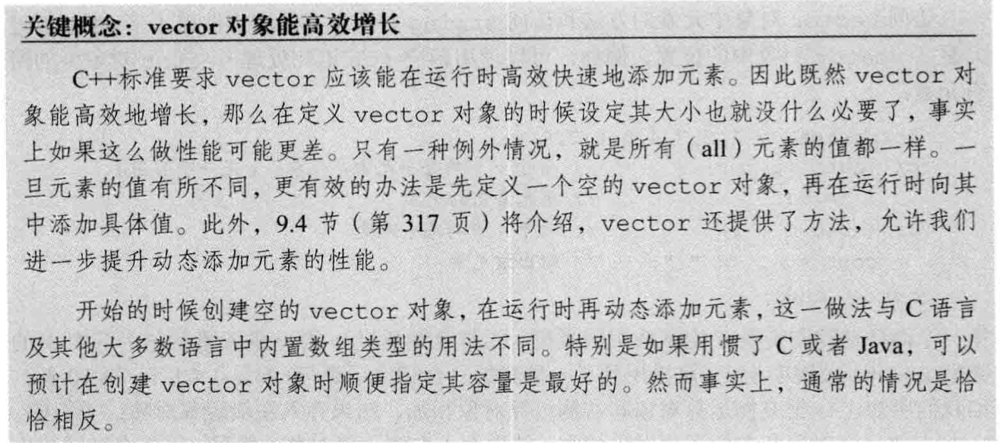

# 标准库类型vector

* C++既有类模版，也有函数模版，vector就是一个类模版。
* 模版本身不是类或者函数，可以将模版看作为编译器生成类或者函数的一份说明。
* 编译器根据模版创建类或者函数的过程称之为实例化，使用模版时，需要告诉编译器应该把类或者函数实例化为何种类型（即在尖括号内放上信息）。

# 3.3.1 定义和初始化vector对象
初始化方法：


## 列表初始化vector对象
C++11 新标准提供了一种新的方法为vector对象的元素赋初值的方法，即列表初始化
```c++
    vector<string> v1{"a", "an", "the"}; // 列表初始化
    vector<string> v2("a", "an", "the"); // error
```

## 创建指定数量的元素
```c++
    vector<int> v1(10, 1) // 10个int类型的元素，每个都被初始化为1
    vector<string> v2(10, "hi");
```

## 值初始化
通常情况下，可以只提供vector对象可容纳的元素数量而略去初始值。这个时候库会根据vector对象中的元素类型来给容器中的所有元素创建一个**值初始化**的元素初值。
```c++
    vector<int> v1(10) // 10个int类型的元素，每个都被初始化为0
    vector<string> v2(10);  // 10个int类型的元素，每个都是空string对象
```
**需要注意的是，如果vector对象中元素的类型不支持默认初始化，那我们就必须提供初始的元素值，此时，对于这种类型的对象，只提供元素数量而不设置初始值的方法就不work。**

## 区分列表初始化还是元素数量
```c++
    vector<int> v1(10, 1) // 10个int类型的元素，每个都被初始化为1
    vector<int> v2{10, 1} // v2有两个元素，分别是10和1
```

# 3.3.2 想vector对象中添加元素
直接初始化一般只适用三种情况：
* 初始值已知且数量较少
* 初始值是另一个vector的对象副本
* 所有元素的初始值一样
当不满足以上情况时，一个好的处理方法是先创建一个空的vector，然后再用**push_back**添加元素。

## vector对象能高效增长



# 补充
## 二维vector对象的初始化
```c++
    vector<vector<int>> direction = {{0, 1}, {0, -1}, {1, 0}, {-1, 0}}; // 1. 列表初始化
    vector<vector<int>> vis(n, vector<int>(m, 0)); // 2. 指定元素数量（n行m列）并值初始化

    std::vector<std::vector<int>> matrix(M);  // 使用resize方法
    for (int i = 0 ; i < M ; i++)
        matrix[i].resize(N, 0);
```

# Todo
## push_back vs emplace_back
## 9.4 vector对象是如何增长的
## STL vector的实现
