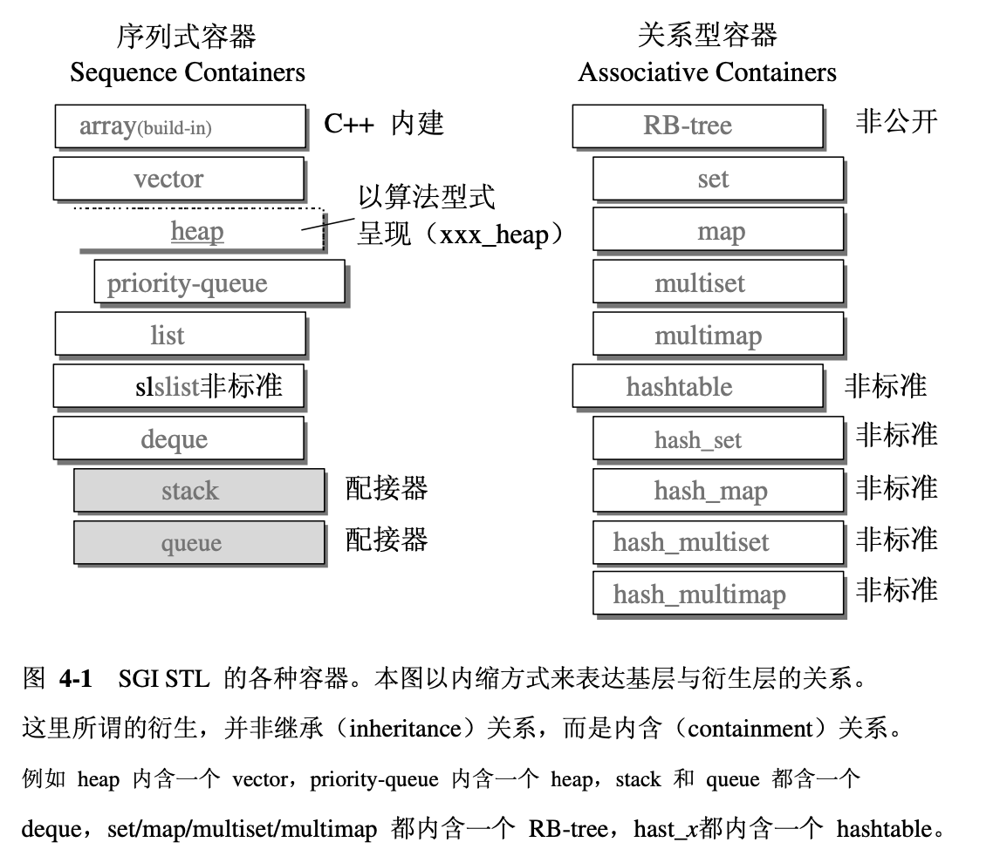

# 序列式容器

# 4.1 容器的概观和分类
按照“资料在容器中的排列”，分为序列型(sequence)容器和关系型(associative)容器。

## 4.1.1 序列式容器
* 所谓序列式容器，其中的元素都是可序的(ordered)，但为排序(sorted)。
* C++语言本身提供了一个序列式容器array，STL另外再提供了vector, list, deque, stack, queue, priority-queue等。
* 其中stack和queue由于只是将deque改头换面而成的，技术上被归类为一种适配器(adapter)。

# 4.2 
# 4.3
# 4.4
# 4.5
# 4.6

# 4.7 heap
heap并不属于STL，它是个幕后英雄，扮演priority-queue的推手
- priority-queue允许使用者以任何次序将任何元素推入容器内，但取出时一定是从优先级最高的元素开始取。
- binary heap(是一种complete binary tree，完全二叉树)正是具有这样的特性，适合用来做priority-queue的底层机制

完全二叉树：整颗二叉树除了最底层的叶子结点外，都是填满的，而底层的叶子结点由左至右又不得有空隙。如果用array来存储所有节点(将0位置保留)，当某元素位于array的i处时：
- 其左子节点必定位于2i处
- 右子节点必定位于2i+1处
- 其父节点必定位于i/2处

## heap算法
### push_heap算法
1. 为满足完全二叉树的条件，新加入的元素一定要放在最下一层的由左至右的最后一个空格，即vector的end()处
2. 为满足max-heap的条件，执行一个percolate up(上溯)程序：将新节点拿来跟父节点比较，如果比父节点大，则交换位置
3. 重复上溯操作，直到不需要交换为止

### pop_heap算法
1. pop操作取走根节点，其实是移至底部容器vector的最后一个元素(第一个元素和最后一个元素交换位置)
2. 为满足max-heap的条件，执行一个percolate down(下放)程序：将根节点与两个子节点比较，并与较大的子节点交换位置
3. 重复下放操作，直到不需要交换为止
**注意：pop_head之后，最大元素只是被放在vector的最尾端，尚未被取走，可以用back()来获取，用pop_back()来移除它。**

### sort_heap算法
1. 既然每次pop_heap可以获得heap之后的最大元素，那么如果一直对heap做pop_heap，每次将操作范围从后向前缩减一个元素，当整个程序执行完毕，我们就有了一个递增序列
2. 需要注意的是，拍过序后，原来的heap就不再是一个合法的heap了

### make_heap算法
将一段现有的数据转化为一个heap

### heap没有迭代器
heap的所有元素都必须遵循完全二叉树的排列规则，所以heap没有迭代器

# 4.8 priority_queue
顾名思义，priority_queue是一个拥有权值观念的queue。

## 4.8.2 priority_queue定义完整列表
- 由于priority_queue完全以底部容器为根据，加上heap处理规则，所以实现比较简单。
- priority_queue以底部容器完成其所有工作，具备这种（修改某物接口，而形成另一种风貌）的性质者，称之为适配器。因此，priority_queue往往不被归类为container，而是被归类为container adapter。

## 4.8.3 priority_queue没有迭代器
priority_queue进出都有一定规则，所以没有迭代器