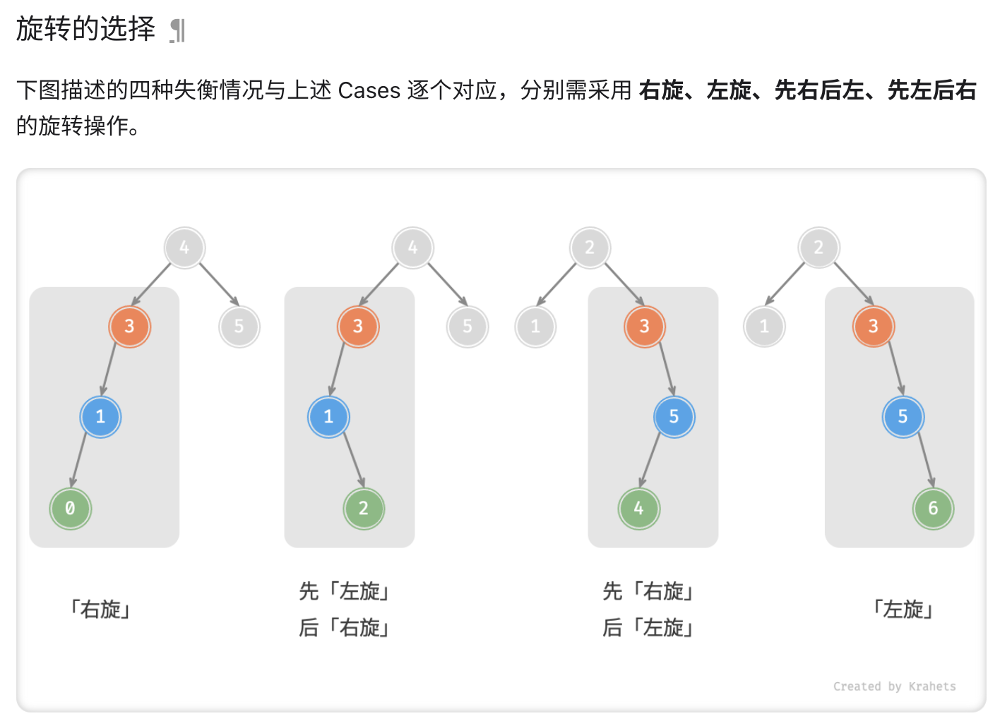

# Data Structure

## 二叉树
性质：
1. 非空二叉树第 i 层最多 2(i-1) 个结点 （i >= 1）
2. 深度为 k 的二叉树最多 2k - 1 个结点 （k >= 1）
3. 度为 0 的结点数为 n0，度为 2 的结点数为 n2，则 n0 = n2 + 1
4. 有 n 个结点的完全二叉树深度 k = ⌊ log2(n) ⌋ + 1 
5. 对于含 n 个结点的完全二叉树中编号为 i （1 <= i <= n） 的结点
    1. 若 i = 1，为根，否则双亲为 ⌊ i / 2 ⌋
    2. 若 2i > n，则 i 结点没有左孩子，否则孩子编号为 2i
    3. 若 2i + 1 > n，则 i 结点没有右孩子，否则孩子编号为 2i + 1

## 满二叉树
除最后一层无任何子节点外，每一层上的所有结点都有两个子结点的二叉树。

## 完全二叉树 => 堆
(Complete Binary Tree) 只有最底层的结点未被填满，且最底层结点尽量靠左填充。

## 二叉搜索树
左 < 根 < 右

## AVL树（平衡二叉搜索树）
- 在二叉搜索树的基础上， | 左子树树高 - 右子树树高 | <= 1
- 平衡二叉树插入新结点导致失衡的子树：调整：
    * LL型：右旋
    * RR型：左旋
    * LR型：先左旋，再右旋
    * RL型：先右旋，再左旋

[具体请参考](https://www.hello-algo.com/chapter_tree/avl_tree/#_3)

## 红黑树

### 红黑树的特征是什么？
1. 节点是红色或黑色。
2. 根是黑色。
3. 所有叶子都是黑色（叶子是 NIL 节点）。
4. 每个红色节点必须有两个黑色的子节点。（从每个叶子到根的所有路径上不能有两个连续的红色节点。）（新增节点的父节点必须相同）
5. 从任一节点到其每个叶子的所有简单路径都包含相同数目的黑色节点。（新增节点必须为红）

### 调整
1. 变色
2. 左旋
3. 右旋

### 应用
* 关联数组：如 STL 中的 map、set

## B树和B+树

### 区别
- B+树中只有叶子节点会带有指向记录的指针（ROWID），而B树则所有节点都带有，在内部节点出现的索引项不会再出现在叶子节点中。
- B+树中所有叶子节点都是通过指针连接在一起，而B树不会。