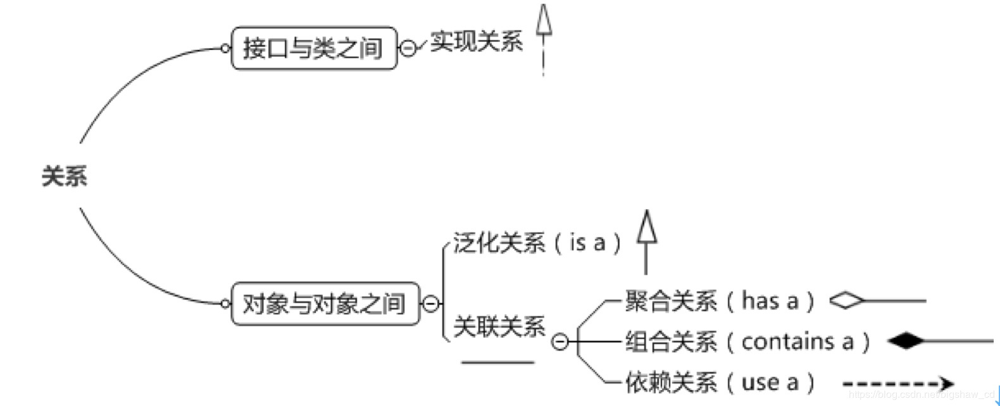

# UML
Refer from：https://zhuanlan.zhihu.com/p/109655171

## 在类图中表示关系

### 实现关系
接口和类之间的关系(三角形+虚线)

### 泛化关系 （is a）
类与类之间的继承关系(三角形(被继承的类)+实线)

### 关联关系
一个类中包含另一个类的对象，因此它可以知道另外一个类中的方法(箭头指向的一方为被包含的一方)

### 依赖关系 （use a）
是一种弱关联关系，用虚线箭头表示，如：
    - B为A的构造器或方法中的局部变量、方法或构造器的参数、方法的返回值，或者A调用B的静态方法。

### 聚合关系(has a) 和 组合关系(contain a)
1. 聚合是关联关系的一种特例，它体现的是整体与部分的拥有关系，即 “has a” 的关系。此时整体与部分之间是可分离的，它们可以具有各自的生命周期。用空心菱形（菱形一方为整体）+箭头表示。
2. 组合也是关联关系的一种特例，它同样体现整体与部分间的包含关系，即 “contains a” 的关系。但此时整体与部分是不可分的，部分也不能给其它整体共享，作为整体的对象负责部分的对象的生命周期。用实心菱形（菱形一方为整体）+箭头表示。
