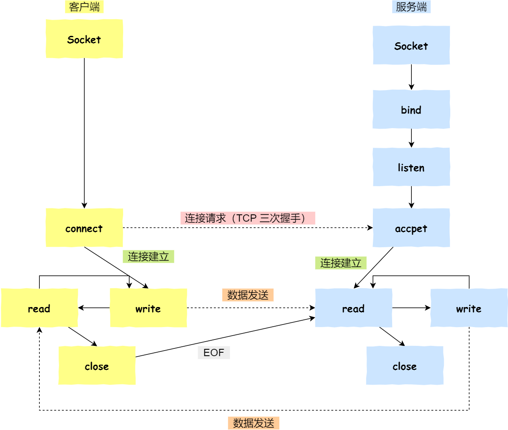

# TCP 三次握手与四次挥手面试题

## TCP基础
1. 序列号：在建立连接时由计算机生成的随机数作为其初始值，通过 SYN 包传给接收端主机，每发送一次数据，就「累加」一次该「数据字节数」的大小。**用来解决网络包乱序问题。**
2. 确认应答号：指下一次「期望」收到的数据的序列号，发送端收到这个确认应答以后可以认为在这个序号以前的数据都已经被正常接收。**用来解决丢包的问题。**
3. 控制位：
    - ACK：该位为 1 时，「确认应答」的字段变为有效，TCP 规定除了最初建立连接时的 SYN 包之外该位必须设置为 1 。
    - RST：该位为 1 时，表示 TCP 连接中出现异常必须强制断开连接。
    - SYN：该位为 1 时，表示希望建立连接，并在其「序列号」的字段进行序列号初始值的设定。
    - FIN：该位为 1 时，表示今后不会再有数据发送，希望断开连接。当通信结束希望断开连接时，通信双方的主机之间就可以相互交换 FIN 位为 1 的 TCP 段。

## 为什么需要 TCP 协议？ TCP 工作在哪一层？
- IP 层是「不可靠」的，它不保证网络包的交付、不保证网络包的按序交付、也不保证网络包中的数据的完整性。
- 如果需要保障网络数据包的可靠性，那么就需要由上层（传输层）的 TCP 协议来负责。因为 TCP 是一个工作在传输层的可靠数据传输的服务，它能确保接收端接收的网络包是无损坏、无间隔、非冗余和按序的。

## 什么是TCP？
TCP 是面向连接的、可靠的、基于字节流的传输层通信协议。
- 面向连接：一定是「一对一」才能连接，不能像 UDP 协议可以一个主机同时向多个主机发送消息，也就是一对多是无法做到的；
- 可靠的：无论的网络链路中出现了怎样的链路变化，TCP 都可以保证一个报文一定能够到达接收端；
- 字节流：用户消息通过 TCP 协议传输时，消息可能会被操作系统「分组」成多个的 TCP 报文，如果接收方的程序如果不知道「消息的边界」，是无法读出一个有效的用户消息的。并且 TCP 报文是「有序的」，当「前一个」TCP 报文没有收到的时候，即使它先收到了后面的 TCP 报文，那么也不能扔给应用层去处理，同时对「重复」的 TCP 报文会自动丢弃。

### 什么是TCP连接？
用于保证可靠性和流量控制维护的某些状态信息，这些信息的组合，包括 Socket、序列号和窗口大小称为连接。所以我们可以知道，建立一个 TCP 连接是需要客户端与服务端达成上述三个信息的共识：
- Socket：由 IP 地址和端口号组成
- 序列号：用来解决乱序问题等
- 窗口大小：用来做流量控制

### 如何唯一确定一个 TCP 连接呢？
- 源地址
- 源端口
- 目的地址
- 目的端口
源地址和目的地址的字段（32 位）是在 IP 头部中，作用是通过 IP 协议发送报文给对方主机。源端口和目的端口的字段（16 位）是在 TCP 头部中，作用是告诉 TCP 协议应该把报文发给哪个进程。

## UDP 和 TCP 有什么区别呢？分别的应用场景是？
UDP 不提供复杂的控制机制，利用 IP 提供面向「无连接」的通信服务。UDP 协议真的非常简，头部只有 8 个字节（64 位）：
- 目标和源端口：主要是告诉 UDP 协议应该把报文发给哪个进程。
- 包长度：该字段保存了 UDP 首部的长度跟数据的长度之和。
- 校验和：校验和是为了提供可靠的 UDP 首部和数据而设计，防止收到在网络传输中受损的 UDP 包。

### TCP 和 UDP 区别：
1. 连接
    - TCP 是面向连接的传输层协议，传输数据前先要建立连接。
    - UDP 是不需要连接，即刻传输数据。
2. 服务对象
    - TCP 是一对一的两点服务，即一条连接只有两个端点。
    - UDP 支持一对一、一对多、多对多的交互通信。
3. 可靠性
    - TCP 是可靠交付数据的，数据可以无差错、不丢失、不重复、按序到达。
    - UDP 是尽最大努力交付，不保证可靠交付数据。但是我们可以基于 UDP 传输协议实现一个可靠的传输协议，比如 QUIC 协议
4. 拥塞控制、流量控制
    - TCP 有拥塞控制和流量控制机制，保证数据传输的安全性。
    - UDP 则没有，即使网络非常拥堵了，也不会影响 UDP 的发送速率。
5. 首部开销
    - TCP 首部长度较长，会有一定的开销，首部在没有使用「选项」字段时是 20 个字节，如果使用了「选项」字段则会变长的。
    - UDP 首部只有 8 个字节，并且是固定不变的，开销较小。
6. 传输方式
    - TCP 是流式传输，没有边界，但保证顺序和可靠。
    - UDP 是一个包一个包的发送，是有边界的，但可能会丢包和乱序。
7. 分片不同
    - TCP 的数据大小如果大于 MSS 大小，则会在传输层进行分片，目标主机收到后，也同样在传输层组装 TCP 数据包，如果中途丢失了一个分片，只需要传输丢失的这个分片。
    - UDP 的数据大小如果大于 MTU 大小，则会在 IP 层进行分片，目标主机收到后，在 IP 层组装完数据，接着再传给传输层。

### TCP 和 UDP 应用场景：
由于 TCP 是面向连接，能保证数据的可靠性交付，因此经常用于：
    - FTP 文件传输；
    - HTTP / HTTPS；
由于 UDP 面向无连接，它可以随时发送数据，再加上 UDP 本身的处理既简单又高效，因此经常用于：
    - 包总量较少的通信，如 DNS 、SNMP 等；
    - 视频、音频等多媒体通信；
    - 广播通信；

### TCP 和 UDP 可以使用同一个端口吗？
可以的
- 在数据链路层中，通过 MAC 地址来寻找局域网中的主机。在网际层中，通过 IP 地址来寻找网络中互连的主机或路由器。在传输层中，需要通过端口进行寻址，来识别同一计算机中同时通信的不同应用程序。
- 所以，传输层的「端口号」的作用，是为了区分同一个主机上不同应用程序的数据包。传输层有两个传输协议分别是 TCP 和 UDP，在内核中是两个完全独立的软件模块。

## TCP连接建立

**三次握手**
1. 一开始，客户端和服务端都处于 CLOSE 状态。先是服务端主动监听某个端口，处于 LISTEN 状态
2. 客户端会随机初始化序号（client_isn），将此序号置于 TCP 首部的「序号」字段中，同时把 SYN 标志位置为 1，表示 SYN 报文。接着把第一个 SYN 报文发送给服务端，表示向服务端发起连接，该报文不包含应用层数据，之后客户端处于 SYN-SENT 状态。
3. 服务端收到客户端的 SYN 报文后，首先服务端也随机初始化自己的序号（server_isn），将此序号填入 TCP 首部的「序号」字段中，其次把 TCP 首部的「确认应答号」字段填入 client_isn + 1, 接着把 SYN 和 ACK 标志位置为 1。最后把该报文发给客户端，该报文也不包含应用层数据，之后服务端处于 SYN-RCVD 状态。
4. 客户端收到服务端报文后，还要向服务端回应最后一个应答报文，首先该应答报文 TCP 首部 ACK 标志位置为 1 ，其次「确认应答号」字段填入 server_isn + 1 ，最后把报文发送给服务端，这次报文可以携带客户到服务端的数据，之后客户端处于 ESTABLISHED 状态。
5. 服务端收到客户端的应答报文后，也进入 ESTABLISHED 状态。
**从上面的过程可以发现第三次握手是可以携带数据的，前两次握手是不可以携带数据的，这也是面试常问的题。一旦完成三次握手，双方都处于 ESTABLISHED 状态，此时连接就已建立完成，客户端和服务端就可以相互发送数据了。**

### 为什么是三次握手？不是两次、四次？
比较常回答的是：“因为三次握手才能保证双方具有接收和发送的能力”。这个回答是片面的，为什么三次握手才可以初始化 Socket、序列号和窗口大小并建立 TCP 连接:
1. 三次握手才可以阻止重复历史连接的初始化（主要原因）
    -（我们考虑一个场景，客户端先发送了 SYN（seq = 90）报文，然后客户端宕机了，而且这个 SYN 报文还被网络阻塞了，服务端并没有收到，接着客户端重启后，又重新向服务端建立连接，发送了 SYN（seq = 100）报文（注意！不是重传 SYN，重传的 SYN 的序列号是一样的）。）
    - 如果是两次握手连接，就无法阻止历史连接，那为什么 TCP 两次握手为什么无法阻止历史连接呢？我先直接说结论，主要是因为在两次握手的情况下，服务端没有中间状态给客户端来阻止历史连接，导致服务端可能建立一个历史连接，造成资源浪费。
2. 三次握手才可以同步双方的初始序列号
    - 接收方可以去除重复的数据；
    - 接收方可以根据数据包的序列号按序接收；
    - 可以标识发送出去的数据包中， 哪些是已经被对方收到的（通过 ACK 报文中的序列号知道）；
    - （四次握手其实也能够可靠的同步双方的初始化序号，但由于第二步和第三步可以优化成一步，所以就成了「三次握手」。而两次握手只保证了一方的初始序列号能被对方成功接收，没办法保证双方的初始序列号都能被确认接收。）
3. 三次握手才可以避免资源浪费
    - 如果客户端发送的 SYN 报文在网络中阻塞了，重复发送多次 SYN 报文，那么服务端在收到请求后就会建立多个冗余的无效链接，造成不必要的资源浪费。

小结：
1. TCP 建立连接时，通过三次握手能防止历史连接的建立，能减少双方不必要的资源开销，能帮助双方同步初始化序列号。序列号能够保证数据包不重复、不丢弃和按序传输。
2. 不使用「两次握手」和「四次握手」的原因：
    - 「两次握手」：无法防止历史连接的建立，会造成双方资源的浪费，也无法可靠的同步双方序列号；
    - 「四次握手」：三次握手就已经理论上最少可靠连接建立，所以不需要使用更多的通信次数。

### 为什么每次建立 TCP 连接时，初始化的序列号都要求不一样呢？
- 为了防止历史报文被下一个相同四元组的连接接收（主要方面）；
- 为了安全性，防止黑客伪造的相同序列号的 TCP 报文被对方接收；

### 既然 IP 层会分片，为什么 TCP 层还需要 MSS 呢？
- MTU：一个网络包的最大长度，以太网中一般为 1500 字节；
- MSS：除去 IP 和 TCP 头部之后，一个网络包所能容纳的 TCP 数据的最大长度；
如果在 TCP 的整个报文（头部 + 数据）交给 IP 层进行分片，那么当如果一个 IP 分片丢失，整个 IP 报文的所有分片都得重传。经过 TCP 层分片后，如果一个 TCP 分片丢失后，进行重发时也是以 MSS 为单位，而不用重传所有的分片，大大增加了重传的效率。

### 第一次握手丢失了，会发生什么？
- 如果客户端迟迟收不到服务端的 SYN-ACK 报文（第二次握手），**就会触发「超时重传」机制，重传 SYN 报文，而且重传的 SYN 报文的序列号都是一样的。**
- 在 Linux 里，客户端的 SYN 报文最大重传次数由 tcp_syn_retries内核参数控制，这个参数是可以自定义的，默认值一般是 5。
- 通常，第一次超时重传是在 1 秒后，第二次超时重传是在 2 秒，第三次超时重传是在 4 秒后，第四次超时重传是在 8 秒后，第五次是在超时重传 16 秒后。没错，每次超时的时间是上一次的 2 倍。

### 第二次握手丢失了，会发生什么？
- 因为第二次握手报文里是包含对客户端的第一次握手的 ACK 确认报文，所以，如果客户端迟迟没有收到第二次握手，那么客户端就觉得可能自己的 SYN 报文（第一次握手）丢失了，**于是客户端就会触发超时重传机制，重传 SYN 报文。**
- 然后，因为第二次握手中包含服务端的 SYN 报文，所以当客户端收到后，需要给服务端发送 ACK 确认报文（第三次握手），服务端才会认为该 SYN 报文被客户端收到了。那么，如果第二次握手丢失了，服务端就收不到第三次握手，**于是服务端这边会触发超时重传机制，重传 SYN-ACK 报文。**

### 第三次握手丢失了，会发生什么？
- 因为这个第三次握手的 ACK 是对第二次握手的 SYN 的确认报文，所以当第三次握手丢失了，如果服务端那一方迟迟收不到这个确认报文，**就会触发超时重传机制，重传 SYN-ACK 报文，直到收到第三次握手，或者达到最大重传次数。**
- 注意，ACK 报文是不会有重传的，当 ACK 丢失了，就由对方重传对应的报文。

### 什么是 SYN 攻击？如何避免 SYN 攻击？
在 TCP 三次握手的时候，Linux 内核会维护两个队列，分别是：
- 半连接队列，也称 SYN 队列；
- 全连接队列，也称 accept 队列；

不管是半连接队列还是全连接队列，都有最大长度限制，超过限制时，默认情况都会丢弃报文。SYN 攻击方式最直接的表现就会把 TCP 半连接队列打满，这样当 TCP 半连接队列满了，后续再在收到 SYN 报文就会丢弃，导致客户端无法和服务端建立连接。避免 SYN 攻击方式，可以有以下四种方法：
- 调大 netdev_max_backlog；
- 增大 TCP 半连接队列；
- 开启 tcp_syncookies；
- 减少 SYN+ACK 重传次数

## TCP四次挥手

双方都可以主动断开连接，断开连接后主机中的「资源」将被释放，四次挥手的过程如下：
1. 客户端打算关闭连接，此时会发送一个 TCP 首部 FIN 标志位被置为 1 的报文，也即 FIN 报文，之后客户端进入 FIN_WAIT_1 状态。
2. 服务端收到该报文后，就向客户端发送 ACK 应答报文，接着服务端进入 CLOSE_WAIT 状态。
3. 客户端收到服务端的 ACK 应答报文后，之后进入 FIN_WAIT_2 状态。
4. 等待服务端处理完数据后，也向客户端发送 FIN 报文，之后服务端进入 LAST_ACK 状态。
5. 客户端收到服务端的 FIN 报文后，回一个 ACK 应答报文，之后进入 TIME_WAIT 状态
6. 服务端收到了 ACK 应答报文后，就进入了 CLOSE 状态，至此服务端已经完成连接的关闭。
7. 客户端在经过 2MSL 一段时间后，自动进入 CLOSE 状态，至此客户端也完成连接的关闭。(MSL 是 Maximum Segment Lifetime，报文最大生存时间，它是任何报文在网络上存在的最长时间，超过这个时间报文将被丢弃。Linux将MSL设置为30秒)
你可以看到，每个方向都需要一个 FIN 和一个 ACK，因此通常被称为四次挥手。这里一点需要注意是：主动关闭连接的，才有 TIME_WAIT 状态。

### 为什么挥手需要四次？
- 关闭连接时，客户端向服务端发送 FIN 时，仅仅表示客户端不再发送数据了但是还能接收数据。
- 服务端收到客户端的 FIN 报文时，先回一个 ACK 应答报文，而服务端可能还有数据需要处理和发送，等服务端不再发送数据时，才发送 FIN 报文给客户端来表示同意现在关闭连接。
从上面过程可知，服务端通常需要等待完成数据的发送和处理，所以服务端的 ACK 和 FIN 一般都会分开发送，因此是需要四次挥手。

### 第一次挥手丢失了，会发生什么？
- 当客户端（主动关闭方）调用 close 函数后，就会向服务端发送 FIN 报文，试图与服务端断开连接，此时客户端的连接进入到 FIN_WAIT_1 状态。正常情况下，如果能及时收到服务端（被动关闭方）的 ACK，则会很快变为 FIN_WAIT2状态。
- **如果第一次挥手丢失了，那么客户端迟迟收不到被动方的 ACK 的话，也就会触发超时重传机制**，重传 FIN 报文，重发次数由 tcp_orphan_retries 参数控制。当客户端重传 FIN 报文的次数超过 tcp_orphan_retries 后，就不再发送 FIN 报文，则会在等待一段时间（时间为上一次超时时间的 2 倍），如果还是没能收到第二次挥手，那么直接进入到 close 状态。

### 第二次挥手丢失了，会发生什么？
- 当服务端收到客户端的第一次挥手后，就会先回一个 ACK 确认报文，此时服务端的连接进入到 CLOSE_WAIT 状态。
- 在前面我们也提了，**ACK 报文是不会重传的，所以如果服务端的第二次挥手丢失了，客户端就会触发超时重传机制，重传 FIN 报文**，直到收到服务端的第二次挥手，或者达到最大的重传次数。
- 这里提一下，当客户端收到第二次挥手，也就是收到服务端发送的 ACK 报文后，客户端就会处于 FIN_WAIT2 状态，在这个状态需要等服务端发送第三次挥手，也就是服务端的 FIN 报文。
    - 对于 close 函数关闭的连接，由于无法再发送和接收数据，所以FIN_WAIT2 状态不可以持续太久，而 tcp_fin_timeout 控制了这个状态下连接的持续时长，60 秒后还没有收到 FIN 报文，客户端（主动关闭方）的连接就会直接关闭。
    - 如果主动关闭方使用 shutdown 函数关闭连接，指定了只关闭发送方向，而接收方向并没有关闭，那么意味着主动关闭方还是可以接收数据的。此时，如果主动关闭方一直没收到第三次挥手，那么主动关闭方的连接将会一直处于 FIN_WAIT2 状态（tcp_fin_timeout 无法控制 shutdown 关闭的连接）。

### 第三次挥手丢失了，会发生什么？
- 当服务端（被动关闭方）收到客户端（主动关闭方）的 FIN 报文后，内核会自动回复 ACK，同时连接处于 CLOSE_WAIT 状态，顾名思义，它表示等待应用进程调用 close 函数关闭连接。（内核是没有权利替代进程关闭连接，必须由进程主动调用 close 函数来触发服务端发送 FIN 报文。）当 close 函数被调用后，内核就会发出 FIN 报文，同时连接进入 LAST_ACK 状态，等待客户端返回 ACK 来确认连接关闭。
- **如果迟迟收不到这个关闭方的 ACK，服务端就会重发 FIN 报文**，重发次数仍然由 tcp_orphan_retries 参数控制，这与客户端重发 FIN 报文的重传次数控制方式是一样的。当服务端重传第三次挥手报文达到了重传最大次数时，于是再等待一段时间（时间为上一次超时时间的 2 倍），如果还是没能收到客户端的第四次挥手（ACK报文），那么服务端就会断开连接。
- 客户端因为是通过 close 函数关闭连接的，处于 FIN_WAIT_2 状态是有时长限制的，如果 tcp_fin_timeout 时间内（默认是60s）还是没能收到服务端的第三次挥手（FIN 报文），那么客户端就会断开连接。

### 第四次挥手丢失了，会发生什么？
- 当客户端收到服务端的第三次挥手的 FIN 报文后，就会回 ACK 报文，也就是第四次挥手，此时客户端连接进入 TIME_WAIT 状态。在 Linux 系统，TIME_WAIT 状态会持续 2MSL 后才会进入关闭状态。
- 服务端（被动关闭方）没有收到 ACK 报文前，还是处于 LAST_ACK 状态。**如果第四次挥手的 ACK 报文没有到达服务端，服务端就会重发 FIN 报文**，重发次数仍然由前面介绍过的 tcp_orphan_retries 参数控制。当服务端重传第三次挥手报文达到了最大重传次数时，于是再等待一段时间（时间为上一次超时时间的 2 倍），如果还是没能收到客户端的第四次挥手（ACK 报文），那么服务端就会断开连接。
- 客户端在收到第三次挥手后，就会进入 TIME_WAIT 状态，开启时长为 2MSL 的定时器，如果途中再次收到第三次挥手（FIN 报文）后，就会重置定时器，当等待 2MSL 时长后，客户端就会断开连接。

### 为什么 TIME_WAIT 等待的时间是 2MSL？
- MSL 是 Maximum Segment Lifetime，报文最大生存时间，它是任何报文在网络上存在的最长时间，超过这个时间报文将被丢弃。
- TTL 是IP头中的一个字段，是 IP 数据报可以经过的最大路由数，每经过一个处理他的路由器此值就减 1，当此值为 0 则数据报将被丢弃，同时发送 ICMP 报文通知源主机。
- MSL 与 TTL 的区别：MSL 的单位是时间，而 TTL 是经过路由跳数。所以 MSL 应该要大于等于 TTL 消耗为 0 的时间，以确保报文已被自然消亡。
**TIME_WAIT 等待 2 倍的 MSL，比较合理的解释是**：
- 网络中可能存在来自发送方的数据包，当这些发送方的数据包被接收方处理后又会向对方发送响应，所以一来一回需要等待 2 倍的时间。
- 可以看到 2MSL时长 这其实是相当于至少允许报文丢失一次。比如，若 ACK 在一个 MSL 内丢失，这样被动方重发的 FIN 会在第 2 个 MSL 内到达，TIME_WAIT 状态的连接可以应对。
- 2MSL 的时间是从客户端接收到 FIN 后发送 ACK 开始计时的。如果在 TIME-WAIT 时间内，因为客户端的 ACK 没有传输到服务端，客户端又接收到了服务端重发的 FIN 报文，那么 2MSL 时间将重新计时。
- 在 Linux 系统里 2MSL 默认是 60 秒，那么一个 MSL 也就是 30 秒。Linux 系统停留在 TIME_WAIT 的时间为固定的 60 秒。

### 为什么需要 TIME_WAIT 状态？
主动发起关闭连接的一方，才会有 TIME-WAIT 状态。
- 防止历史连接中的数据，被后面相同四元组的连接错误的接收；
    1. 序列号和初始化序列号并不是无限递增的，会发生回绕为初始值的情况，这意味着无法根据序列号来判断新老数据。
    2. 为了防止历史连接中的数据，被后面相同四元组的连接错误的接收，因此 TCP 设计了 TIME_WAIT 状态，状态会持续 2MSL 时长，这个时间足以让两个方向上的数据包都被丢弃，使得原来连接的数据包在网络中都自然消失，再出现的数据包一定都是新建立连接所产生的。
- 保证「被动关闭连接」的一方，能被正确的关闭；
    - TIME-WAIT 作用是等待足够的时间以确保最后的 ACK 能让被动关闭方接收，从而帮助其正常关闭。
    - 客户端必须等待足够长的时间，确保服务端能够收到 ACK，如果服务端没有收到 ACK，那么就会触发 TCP 重传机制，服务端会重新发送一个 FIN，这样一去一来刚好两个 MSL 的时间。

### TIME_WAIT 过多有什么危害？
- 第一是占用系统资源，比如文件描述符、内存资源、CPU 资源、线程资源等；
- 第二是占用端口资源，端口资源也是有限的，一般可以开启的端口为 32768～61000，也可以通过 net.ipv4.ip_local_port_range参数指定范围。
- **如果客户端（主动发起关闭连接方）的 TIME_WAIT 状态过多**，占满了所有端口资源，那么就无法对「目的 IP+ 目的 PORT」都一样的服务端发起连接了，但是被使用的端口，还是可以继续对另外一个服务端发起连接的。
- **如果服务端（主动发起关闭连接方）的 TIME_WAIT 状态过多**，并不会导致端口资源受限，因为服务端只监听一个端口，而且由于一个四元组唯一确定一个 TCP 连接，因此理论上服务端可以建立很多连接，但是 TCP 连接过多，会占用系统资源，比如文件描述符、内存资源、CPU 资源、线程资源等。

### 如何优化 TIME_WAIT？
1. 打开 net.ipv4.tcp_tw_reuse 和 net.ipv4.tcp_timestamps 选项；
    - 这些Linux 内核参数开启后，则可以复用处于 TIME_WAIT 的 socket 为新的连接所用。
2. 程序中使用 SO_LINGER ，应用强制使用 RST 关闭。
    - 我们可以通过设置 socket 选项，来设置调用 close 关闭连接行为。

### 服务器出现大量 TIME_WAIT 状态的原因有哪些？
首先要知道 TIME_WAIT 状态是主动关闭连接方才会出现的状态，所以如果服务器出现大量的 TIME_WAIT 状态的 TCP 连接，就是说明服务器主动断开了很多 TCP 连接。什么场景下服务端会主动断开连接呢？
1. HTTP 没有使用长连接
    - 只要客户端和服务端任意一方的 HTTP header 中有 Connection:close 信息，那么就无法使用 HTTP 长连接的机制。
    - 根据大多数 Web 服务的实现，不管哪一方禁用了 HTTP Keep-Alive，都是由服务端主动关闭连接，那么此时服务端上就会出现 TIME_WAIT 状态的连接。
    - 当服务端出现大量的 TIME_WAIT 状态连接的时候，可以排查下是否客户端和服务端都开启了 HTTP Keep-Alive，因为任意一方没有开启 HTTP Keep-Alive，都会导致服务端在处理完一个 HTTP 请求后，就主动关闭连接，此时服务端上就会出现大量的 TIME_WAIT 状态的连接。
2. HTTP 长连接超时
    - 为了避免资源浪费的情况，web 服务软件一般都会提供一个参数，用来指定 HTTP 长连接的超时时间，比如 nginx 提供的 keepalive_timeout 参数。
    - 假设设置了 HTTP 长连接的超时时间是 60 秒，nginx 就会启动一个「定时器」，如果客户端在完后一个 HTTP 请求后，在 60 秒内都没有再发起新的请求，定时器的时间一到，nginx 就会触发回调函数来关闭该连接，那么此时服务端上就会出现 TIME_WAIT 状态的连接。
3. HTTP 长连接的请求数量达到上限
    - Web 服务端通常会有个参数，来定义一条 HTTP 长连接上最大能处理的请求数量，当超过最大限制时，就会主动关闭连接。比如 nginx 的 keepalive_requests 这个参数，这个参数是指一个 HTTP 长连接建立之后，nginx 就会为这个连接设置一个计数器，记录这个 HTTP 长连接上已经接收并处理的客户端请求的数量。如果达到这个参数设置的最大值时，则 nginx 会主动关闭这个长连接，那么此时服务端上就会出现 TIME_WAIT 状态的连接。
    - keepalive_requests 参数的默认值是 100 ，意味着每个 HTTP 长连接最多只能跑 100 次请求，这个参数往往被大多数人忽略，因为当 QPS (每秒请求数) 不是很高时，默认值 100 凑合够用。但是，对于一些 QPS 比较高的场景，比如超过 10000 QPS，甚至达到 30000 , 50000 甚至更高，如果 keepalive_requests 参数值是 100，这时候就 nginx 就会很频繁地关闭连接，那么此时服务端上就会出大量的 TIME_WAIT 状态。
    - 针对这个场景下，解决的方式也很简单，调大 nginx 的 keepalive_requests 参数就行。

### 服务器出现大量 CLOSE_WAIT 状态的原因有哪些？
- CLOSE_WAIT 状态是「被动关闭方」才会有的状态，而且如果「被动关闭方」没有调用 close 函数关闭连接，那么就无法发出 FIN 报文，从而无法使得 CLOSE_WAIT 状态的连接转变为 LAST_ACK 状态。**所以，当服务端出现大量 CLOSE_WAIT 状态的连接的时候，说明服务端的程序没有调用 close 函数关闭连接。**
- 当服务端出现大量 CLOSE_WAIT 状态的连接的时候，通常都是代码的问题，这时候我们需要针对具体的代码一步一步的进行排查和定位，主要分析的方向就是服务端为什么没有调用 close。

### 如果已经建立了连接，但是客户端突然出现故障了怎么办？
为了避免这种情况，TCP 搞了个保活机制。这个机制的原理是这样的：
- 定义一个时间段，在这个时间段内，如果没有任何连接相关的活动，TCP 保活机制会开始作用，每隔一个时间间隔，发送一个探测报文，该探测报文包含的数据非常少。- 如果连续几个探测报文都没有得到响应，则认为当前的 TCP 连接已经死亡，系统内核将错误信息通知给上层应用程序。
    - tcp_keepalive_time=7200：表示保活时间是 7200 秒（2小时），也就 2 小时内如果没有任何连接相关的活动，则会启动保活机制
    - tcp_keepalive_intvl=75：表示每次检测间隔 75 秒；
    - tcp_keepalive_probes=9：表示检测 9 次无响应，认为对方是不可达的，从而中断本次的连接。

TCP 保活的这个机制检测的时间是有点长，我们可以自己在应用层实现一个心跳机制：
    - 比如，web 服务软件一般都会提供 keepalive_timeout 参数，用来指定 HTTP 长连接的超时时间。如果设置了 HTTP 长连接的超时时间是 60 秒，web 服务软件就会启动一个定时器，如果客户端在完成一个 HTTP 请求后，在 60 秒内都没有再发起新的请求，定时器的时间一到，就会触发回调函数来释放该连接。

### 如果已经建立了连接，但是服务端的进程崩溃会发生什么？
TCP 的连接信息是由内核维护的，所以当服务端的进程崩溃后，内核需要回收该进程的所有 TCP 连接资源，于是内核会发送第一次挥手 FIN 报文，后续的挥手过程也都是在内核完成，并不需要进程的参与，所以即使服务端的进程退出了，还是能与客户端完成 TCP 四次挥手的过程。

## Socket编程
### 针对 TCP 应该如何 Socket 编程？

1. 服务端和客户端初始化 socket，得到文件描述符；
2. 服务端调用 bind，将 socket 绑定在指定的 IP 地址和端口;
3. 服务端调用 listen，进行监听；
4. 服务端调用 accept，等待客户端连接；
5. 客户端调用 connect，向服务端的地址和端口发起连接请求；
6. 服务端 accept 返回用于传输的 socket 的文件描述符；
7. 客户端调用 write 写入数据；服务端调用 read 读取数据；
8. 客户端断开连接时，会调用 close，那么服务端 read 读取数据的时候，就会读取到了 EOF，待处理完数据后，服务端调用 close，表示连接关闭。
**这里需要注意的是，服务端调用 accept 时，连接成功了会返回一个已完成连接的 socket，后续用来传输数据。所以，监听的 socket 和真正用来传送数据的 socket，是「两个」 socket，一个叫作监听 socket，一个叫作已完成连接 socket.**

### 没有 accept，能建立 TCP 连接吗？
- 半连接队列（SYN 队列）：接收到一个 SYN 建立连接请求，处于 SYN_RCVD 状态；
- 全连接队列（Accpet 队列）：已完成 TCP 三次握手过程，处于 ESTABLISHED 状态；
accpet 系统调用并不参与 TCP 三次握手过程，它只是负责从 TCP 全连接队列取出一个已经建立连接的 socket，用户层通过 accpet 系统调用拿到了已经建立连接的 socket，就可以对该 socket 进行读写操作了。